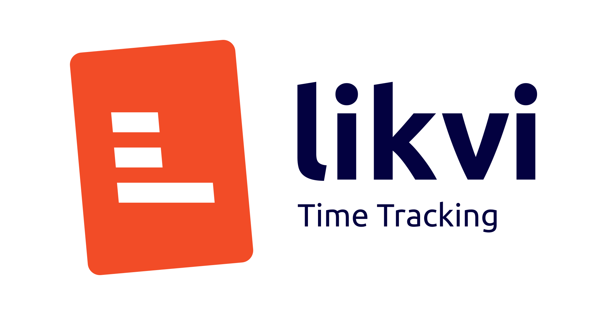

# likvi Time Tracking App

    

The likvi time tracking app is a standalone app for macOS, Windows, and Linux which allows you to conveniently track your working time.  
It integrates into other likvi services so that you can easily create invoices and more out of your tracked time.  
For more information about likvi visit [likvi.de](https://likvi.de) and for details about the time tracking app visit [our landing page](https://likvi.de/zeiterfassung-online).

## Documentation

The latest version for all platforms can be found [here](https://github.com/codelayerhq/likvi-timetracking-desktop/releases/latest).  
Simply download the application for your preferred operating system and install it.  
You are then asked for your likvi credentials.
If you do not have a likvi account, head over to [likvi.de](https://likvi.de) and create one.

After you are logged in you can create and edit new time entries that are synced with the likvi backend service.

## Developer Documentation

This application is built with Vue.js v3 and Electron to allow for easy cross-platform functionality.  
To get started with development, clone this repository, and run `yarn install` to install the required dependencies.  
After you installed all the required dependencies you can run `yarn electron:serve` to spin up a local dev server and build the app with Electron.

You can find the source for the application in the [src folder](src).  
Here is a little rundown of what each folder inside the `src` folder is used for:

<pre>
src
├── App.vue - The main vue file 
├── api - Hold the API clients which communicate with the likvi backend
├── assets - Static assets such as images
├── background.ts - The main progress for electron
├── components - Vue components folder
├── composables - Vue composition api composables
├── i18n - Language files
├── main.ts - Main entry point for the render process
├── preload.ts
├── router - Routing files
├── shims-vue.d.ts
├── store - Vuex store
├── styles - Styles
├── utils - Helper files
└── views - Vue components which represent views
</pre>

You may notice that we use Typescript for our Vue components and other files.  
If you run `yarn electron:serve` like described above the Typescript files should automatically be compiled on the fly so you do not need to worry about the compilation process.

For styling we use [tailwindcss](https://tailwindcss.com), a utility-first CSS framework.
It is strongly recommended to install [Headwind](https://github.com/heybourn/headwind) alongside this project to enforce a consistent ordering of classes.

To enforce consistent formatting in our codebase we also use [Prettier](https://prettier.io), so you should install this, too, and configure Prettier for your development environment.

## FAQ

### Can I use the app without a likvi account?

Currently, you need an active likvi account to use this app.  
If you do not have a likvi account, head over to [likvi.de](https://likvi.de) and create one.

In the future, we may consider building an offline version that does not require an account.

### How can I switch my team?

You can switch your team in the tray menu under `Team`
